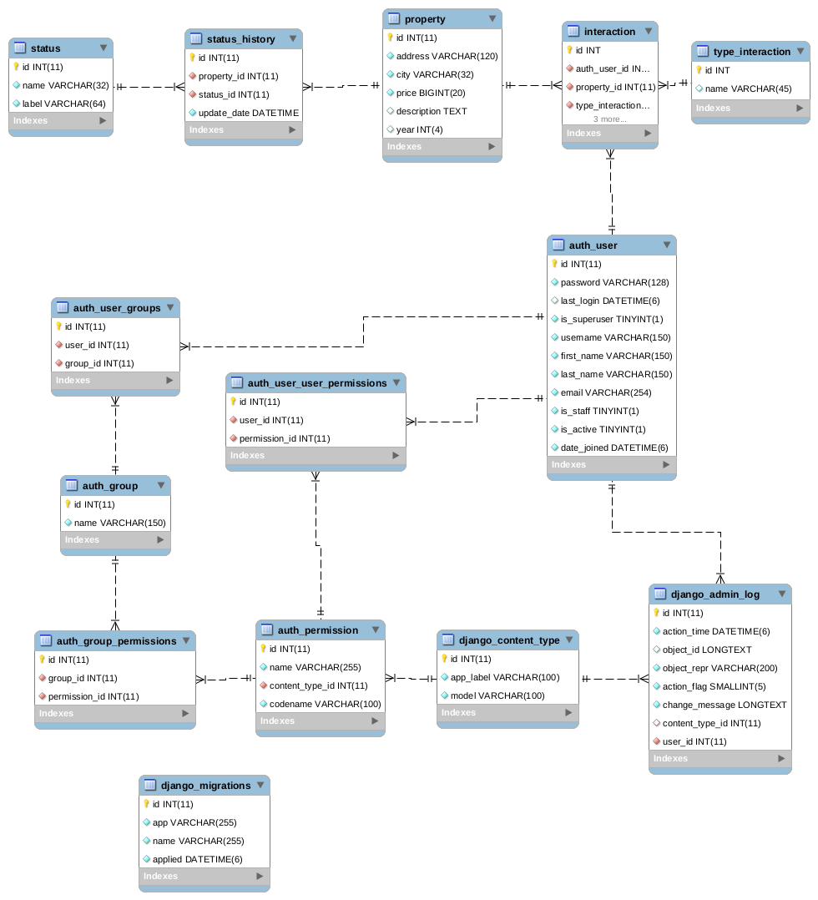
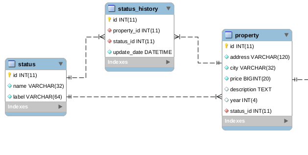

# Property Project

## Tecnologias usadas:
  - Python3.8
  - Unittest
  - Virtualenv
  - MYSQL
  - AWS SAM
  - AWS Lambda
  - AWS Api gateway
  - github actions

## Como se realizo
### Infraestructura y despliegle
El proyecto se realizo usando algunos servicios de AWS, no se utiliza ningun framework mas que SAM(serverless application model), este se usa con el fin de desplegar el proyecto en un infraestructura sin servidor, este tipo de infraestuctura nos proveen ventajas como mejor escalabilidad, costo-eficiencia, reducciion tiempo de desarrollo y configuracion, entre otros.

Se hace uso del servicio lambda de aws, ideal para ejecutar microservicios o tareas que consuman poco tiempo y recursos. Para disponer de un endpoint se uso el servico api gateway de aws, este se encarga de recibir el request y ejecutar por medio de un evento el lambda, pasado los datos del request.

El despliegue se realiza de manera automatica(integracion continua), atravez de la herramienta de github actions, cuando se sube un nuevo cambio a al rama `main`, se realizan dos jobs, testing y deploy, para la rama de `develop` solo se ejecutan el job de testing, la definicion se encuentra en [`.github/workflows/deploy.yaml`](.github/workflows/deploy.yaml)

El api actualmente se encuentra en:


https://9zw24tbwb5.execute-api.us-west-2.amazonaws.com/api/property

    

#### Jobs:
- testing: corre linter flake8, corre las pruebas unitarias
- deploy: despliega los cambios en recursos aws(usa sam)

### Estructura del proyecto
    .
    ├── app.py                          # contiene los handler del los lambda
    ├── README.md                       
    ├── resources                       # contiene algunos recursos del proyecto
    ├── services                        # contiene la logica de los microservicios
    │   ├── habi_db.py            # se encarga de la conexion a la base de datos
    │   └── property_service.py   # contiene la logica de micro sercivisio de property
    └── tests                           # 
        └── test.py                     # contiene las pruebas

### Pruebas unitarias
las pruebas unitarias se realizaron con `unittest`, se definen los eventos en `/resources/evet_*.json`

## Documentacion API
### Obtener propiedades

Url base: https://9zw24tbwb5.execute-api.us-west-2.amazonaws.com

Devuelve las propiedades que se encuentren en los estados: “pre_venta”, “en_venta” y
“vendido”

```http
GET /api/property?page=1&per_page=50
```
| Parametro | Valor por defecto | tipo |Descripcion |
| :--- | :--- | :--- |:--- |
| `page` | `1` | **int** | indica la el numero de la pagina consultada |
| `per_page` | `50` | **int** | cantitdad de datos por pagina |
| `status_id` | `null` | **int** | id del estado en que se encuentra la propiedad |
| `year_gte` | `null` | **int** | obtiene propieades mayores o iguales al dato enviado |
| `year_lte` | `null` | **int** | obtiene propieades menores o iguales al dato enviado |
| `price_gte` | `null` | **number** | obtiene propieades menores o iguales al dato enviado |
| `price_lte` | `null` | **number** |obtiene propieades menores o iguales al dato enviado |
| `city` | `null` | **string** | obtiene solo propiedades de la ciudad indicada |

#### Reponse
```javascript
[
    {
        'address': 'carrera 10...', 
        'city': 'bogota', 
        'status': 'en_venta', 
        'price': 350000000, 
        'description': 'Amplio apar..'
    }
]
```
#### codigos de respuesta http
 | Status Code | Description |
| :--- | :--- |
| 200 | `OK` |
| 400 | `BAD REQUEST` |
| 404 | `NOT FOUND` |
| 500 | `INTERNAL SERVER ERROR` |

## Configuracion de ambiente local

### Instalacion depenciencias
#### Requisitos
- python3
- pip3
- git
- aws-sam-cli
- awscli
#### Instalar awscli y sam-cli
```console
pip3 install aws-sam-cli==1.37.0 awscli
``` 
#### Clonar el proyecto
```console
git clone https://github.com/martinezvictor84/property.git
cd property
```
#### Crear entorno virtual e instalar dependencias
```console
python3 -m virtualenv .venv
source bin/activate
pip install requirements.txt
```

#### Ejecutar pruebas
```console
python unittest tests/test.py
```

#### Levantar api mediente sam
Configurar las variables de entrono en `resources/enviroment_var.json`
```console
sam build -u
sam local start-api -n resources/enviroment_var.json -t template.yaml --docker-network host  --warm-containers EAGER
```

## Propuesta servicio me gusta

### Cambios en base de datos
Se propone agregar dos tablas en la base de datos `interaction` y `type_interaction`

**type_interaction**: almacena los tipos de iteracciones que podria tener un usuario con una propiedad, se agregra un registro para la interaccion like

**interaccion**: guarda la interacccion de un usuario con una propiedad

acontinuacion se muestra un diagrama con los campos propuesto para cada tabla y sus relaciones:



El SQL para ejecutar esta actualizacion lo encuentra [`resources/update_interaction.sql`](resources/update_interaction.sql)

### Endpoint
Para el este servicio es necesario estar autenticado, de la autenticacion se tomara el valor `auth_user.id` para identificar el usuario que realiza la interaccion con la propiedad

```http
POST /api/property/{property_id}/interaction
```
#### Body
```json
{
  "type_interaction_id": 1
}
```
#### Response
 | Status Code | Description |
| :--- | :--- |
| 201 | `CREATED` |
| 400 | `BAD REQUEST` |
| 404 | `NOT FOUND` |
| 500 | `INTERNAL SERVER ERROR` |

## Mejoras sugeridas
Actualmente para consultar el estado de una propiedad debemos buscar primero el ultimo estado registrado en `status_history`. En el momento de aplicar un filtro por estado primero debemos calcular el ultimo estado para cada propiedad, eso hace mas pesado el query y que tome mas tiempo en realizarse.

Como sugerencia para mejorar la velocidad del servicio para consultar las propiedades se recomienda agregar el campo `status_id` en la tabla `property`

modelo resultante:


